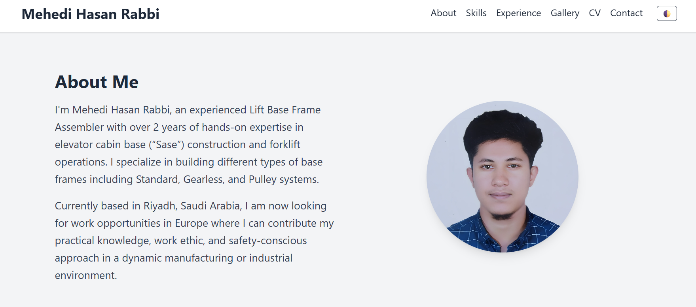

# Mehedi Hasan Rabbi | Elevator Personal Portfolio Website

## 📌 Overview

This is the official portfolio website of **Mehedi Hasan Rabbi**, an experienced Elevator Base Frame Assembler and Forklift Operator currently based in Riyadh, Saudi Arabia. The website showcases his professional background, technical skills, work experience, testimonials, and downloadable documents (CV & Cover Letter).

## 🧰 Technologies Used

- **HTML5**
- **Tailwind CSS 3.x**
- **JavaScript (Vanilla JS)**
- **Dark Mode Support**
- **Fully Responsive Design**

## 🧑‍🔧 Key Sections

- **Hero Section**: Brief intro and call to action
- **About Me**: Personal introduction and goals
- **Skills**: Elevator base frame assembly (Sase), forklift operation, drilling, cutting, MS Word/Excel
- **Experience**: 2+ years of base frame assembly, 1.5+ years forklift operation
- **Gallery**: Images & videos of real work (Standard, Gearless, Pulley Sase types)
- **Documents**: CV & Cover Letter download buttons
- **Testimonials**: Feedback from supervisors
- **Contact Form**: Submit message via email
- **Dark Mode Toggle**: User-friendly experience in both themes

🚀 **Live Portfolio:** [View Online]()  
🖼️ **Screenshot Preview:** 

## 📬 Contact

- 📍 Address: Ghubairah District, Riyadh 12664, Saudi Arabia
- 📞 Phone: +966 582 679 431
- 📧 Email: [mehedihasanrabbivip@gmail.com](mailto:mehedihasanrabbivip@gmail.com)

---

© 2025 Mehedi Hasan Rabbi. All rights reserved.
